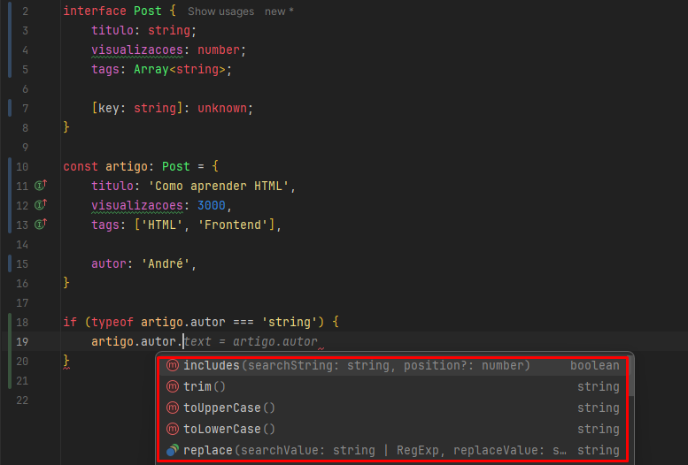
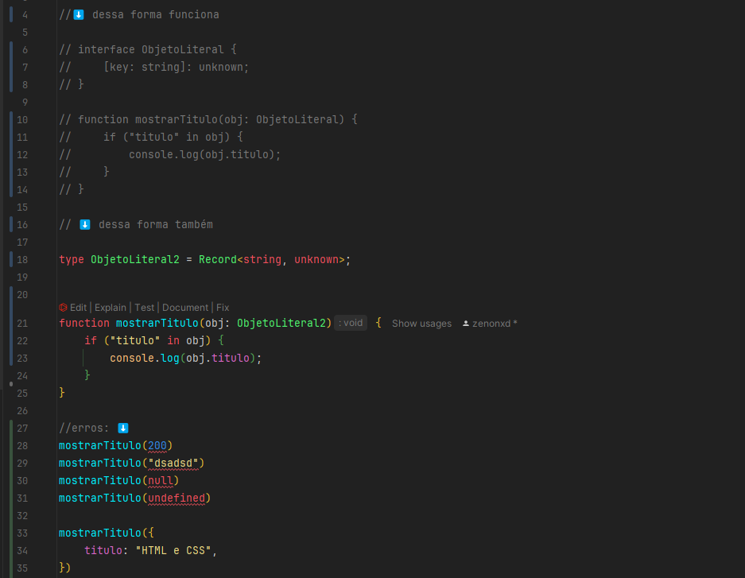
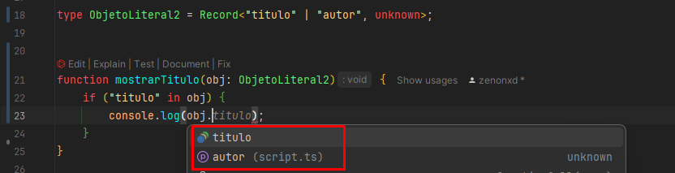

# About

Parte 3 do curso de Typescript da Origamid, lecionado pelo André Rafael.

Agora, entraremos mais em objetos, interfaces, DOM, generics, funções, etc.

Caso tenha alguma dúvida, recorra à [Parte 1]() do estudo.

# Classes

As classes/funções construtoras são responsáveis **pela construção de objetos que já vimos**, como ``MouseEvent``, ``HTMLElement``,
e todos os demais.

Dentro dos {} é onde ficarão as propriedades que irão existir quando instanciarmos essa classe, criando um objeto a partir
dela.

```ts
class Produto {
    tipo = 'produto';
    titulo: string;

    constructor(titulo: string) {
        this.titulo = titulo;
    }
}

const livro = new Produto('O Senhor dos Anéis');
```

Obrigatoriamente, como passamos o atributo de título dentro do construtor, precisamos passar ele ao instanciar o 
objeto.

Se fosse para ser opcional, passaríamos o "?" ``(titulo?: string)``.

## Modificadores (private, protected, readonly)

Irão trazer uma segurança a mais durante a construção da nossa classe.

O TS fornece diversas palavras-chave (Modifiers), que podem ser utilizadas em propriedades de classes, modificando
o comportamento e uso delas.

Podem ser usados nas propriedades e métodos da classe, vejamos:


**Public** - padrão

**Private** - não deixa mais acessar as propriedades fora do escopo da classe. **Ao invés disso, podemos fazer um método
get para buscar o preço, por exemplo.**

**Readonly** - somente leitura.

**Protected** - Diferente do private, deixa subclasses (que estão usando extend) acessarem a propriedade. 

**Static** - Um método estático não está dentro de objetos instanciados, somente da classe em sí. Por exemplo:

```ts
class Produto {
    preco: number;
    
    static transformarPreco(preco: number) {
        return `R$ ${preco}`;
    }
}

const livro = new Produto()
```

Livro não terá acesso ao método `transformarPreco`, somente a classe Produto.

## Class e Interface

Como falamos acima, a classe já gera a interface do objeto.

Portanto, ao definirmos uma classe, a sua interface é gerada automaticamente pelo TS. A definição da classe é o que
utilizamos para verificar se um objeto que criarmos (tipo um `const livro = new Ob()`), é uma instância da mesma, utilizando `instanceof class`.

Note no exemplo abaixo, que antes de acessarmos o método de `getArea()`, nós verificamos se ela é uma `instanceof Quadrado`.


Outro exemplo: um array de números. Mapeamos ele para transformar os números em quadrado/círculo. Depois, fazemos um
forEach para verificar qual número pertence a cada classe, pegando sua respectiva área/perímetro.

```ts
const formas = [2, 32, 12, 3, 4, 20, 37, 9].map((n) => {
  if (n < 15) {
    return new Quadrado(n);
  } else {
    return new Circulo(n);
  }
});

formas.forEach((forma) => {
  if (forma instanceof Quadrado) {
    console.log(forma.getArea());
  }
  if (forma instanceof Circulo) {
    console.log(forma.getPerimetro());
  }
});

```


# Tuples

Tuples são diferentes em cada linguagem, pode ser um dado que possui diferentes dados nele.

No caso do TS, **tuples são arrays que possui dados em posições fixas**.

```ts
//uma array que pode ter string ou number
const produto1: (string | number)[] = ['Notebook', 2500];
//^array normal

//é uma array que possui no primeiro elemento uma string e no segundo um número
const produto2: [string, number] = ['Notebook', 2500];
//^tupla
```

Vamos relembrar o array! Se tentássemos acessar o `produto1[0]`, ele nos daria propriedades de string e number, visto 
que ele não consegue identificar.


Para que ele pudesse identificar e utilizar os métodos, teríamos que fazer um if, verificando seu `typeof`:


## E com as tuplas?

Como podemos ver no `produto2`, nós frisamos que o primeiro elemento é string e segundo number. Isso facilita a
verificação de tipo, não precisaríamos fazer o if:


## Por que tuplas são úteis?

Imagine que a gente queira reestruturar uma array, pegando valores específicos? Veja o que poderíamos fazer:

Automaticamente ao fazer isso, ele irá pegar o primeiro valor `'notebook` e alocar em nome e o segundo em preço. Logo,
nome se torna string e preço se torna number.

```ts
//tupla
const produto2: [string, number] = ['Notebook', 2500];

const [nome, preco] = produto2;
```


## as const

Transforma um dado `readonly` e infere o tipo de dado mais específico possível. Em métodos que retornam Array's, as
mesmas são transformadas em Tuples, vamos ao exemplo:

Quando passamos `as const` no final do returno ele faz duas coisas:

1. A primeira, como vimos, ele transforma essa array em `readonly`, ou seja: não poderíamos alterar o conteúdo do
elemento, o texto... nada.


2. Ele vai inferir o valor mais específico possível

Repare como estava antes do `as const`:


---

E depois:

O retorno da função mudou, juntamente com a declaração do elemento onde agora foi inferido um valor específico a ele.


## Exercício tuples

```ts
// 1 - Faça um fetch das vendas: https://api.origamid.dev/json/vendas.json
// 2 - Defina o tipo/interface de cada venda (tuple)
// 3 - Some o total das vendas e mostre na tela

async function fetchVendas() {
    const response = await fetch("https://api.origamid.dev/json/vendas.json");
    const json = await response.json();
    handleVendas(json);
}

fetchVendas();

type VendaTuple = [string, number, string, { marca: string; cor: string}];

function handleVendas(data: Array<VendaTuple>) {
    let totalVendas = 0;

    if (data) {
        data.forEach((venda) => {
            totalVendas+= venda[1];
            document.body.innerHTML = `
            <p>Total de vendas: ${totalVendas}</p>
            `;

        })
    }

    console.log("Total Vendas: " + totalVendas)
}
```

# Keyof

Indica que um dado (const/let) é uma chave de uma interface ou tipo, veja:

```ts
interface Produto {
  nome: string;
  preco: number;
}

let chave: keyof Produto;
// let chave: "nome" | "produto"; mesma coisa que isso acima ⬆️

chave = 'nome';
chave = 'preco';
```

Quando falamos que chave é `keyof Produto`, ela pode ser `nome`, `preco` ou outro atributo. Entenda, não tem nada a ver
com ser string ou number.

Key é o primeiro valor `nome:` ou `preco:`, o que vale é o valor da esquerda (key).

# Typeof

Já sabemos que o `typeof` no JS é responsável por retornar o tipo de dado.

No TS, podemos **utilizar ele para indicar que um dado possui O MESMO TIPO que outro**.

```ts
function coordenadas(x: number, y: number) {
  return { x, y };
}

let coord: typeof coordenadas;

coord = (x: number, y: number) => {
  return { x, y };
};
```

A partir do momento que declaramos que `coord` tem o tipo de coordenadas (uma função), o TS obriga essa variável a ter
a mesma interface, ou seja: ser uma função, possuir parâmetros e retornar os valores.

# Objetos

Vamos ver agora, como o TS lida com objetos.

## Duck Typing

Um objeto quando é passado em uma função, pode conter propriedades e métodos além dos declarados na interface.

"Se parece com um pato, nada com um pato e grasna como um pato, então provavelmente é um pato."

Note o código abaixo! Nós temos uma interface de Produto com duas propriedades iniciais.

Os dois produtos seguintes, possuem propriedades a mais e, portanto, são válidos como "Produto".

Agora, serviço possui nome, mas não possui a quantidade, logo, não serve.

**Ou seja, você poder ter propriedades a mais, porém não a menos.**

```ts
interface Produto {
  nome: string;
  quantidade: number;
}

const produto1 = {
    nome: 'Notebook',
    quantidade: 10,
    cor: 'azul',
};

const produto2 = {
    nome: 'Geladeira',
    quantidade: 4,
    freezer: true,
};

const servico1 = {
    nome: 'Instalação',
};

function mostrarQuantidade(produto: Produto) {
    console.log(produto.quantidade + 20);
}

mostrarQuantidade(produto1);
mostrarQuantidade(produto2);

// erro, não possui quantidade
mostrarQuantidade(servico1);
```

## Partial - utility types

O TS conta com `utility types`, tipos que podem ser utilizados como funções para a definição de novos tipos.

Com o `Partial<Tipo>`, podemos indicar que todas as propriedades da interface passada em Tipo, são opcionais.

Então podemos pegar uma interface, por exemplo, passar dentro de `Partial`. Após isso, automaticamente ele cria uma NOVA
interface onde as propriedades da interface serão opcionais.

```ts
function mostrarQuantidade(produto: Partial<Produto>) {
  // erro, quantidade pode ser undefined
  console.log(produto.quantidade + 20);
  //para n ser undefined, verificamos se ela existe
    
  if (produto.quantidade) {
      produto.quantidade + 20;
  }  
}
```

Com esse `Partial<Produto>`, os erros que ocorria em [duck typing](#duck-typing), não irão mais ocorrer. Visto que as
propriedades passam a ser opcionais.

## Definindo um objeto com propriedades além das definidas previamente

Podemos definir que um objeto poderá conter propriedades/métodos além dos que foram definidos inicialmente.

Vejamos o exemplo abaixo. Temos uma interface e depois uma constante "Artigo" que é do tipo Post.

```ts
interface Post {
    titulo: string;
    visualizacoes: number;
    tags: Array<string>;
}

const artigo: Post = {
    titulo: 'Como aprender HTML',
    visualizacoes: 3000,
    tags: ['HTML', 'Frontend'],
}
```

E se esse artigo tivesse outras propriedades como, por exemplo, um autor? **Nós indicamos na interface, veja:**

```ts
interface Post {
    titulo: string;
    visualizacoes: number;
    tags: Array<string>;

    [key: string]: unknown;
}

const artigo: Post = {
    titulo: 'Como aprender HTML',
    visualizacoes: 3000,
    tags: ['HTML', 'Frontend'],

    autor: 'André',
}

artigo.autor;
artigo.descricao;
```

O problema, é que como é um valor "unknown", ele nos deixa criar outras propriedades. Para resolver isso, e poder realizar
operações, precisamos fazer a verificação de sempre:



## Record

O record define a interface de um objeto que possui ``<chave, tipo>``. Ele pode ser usado para definir a interface
de um objeto literal genérico.

Repare na imagem abaixo, podemos utilizar a primeira abordagem e a segunda.



Entretanto, um adendo: o `Record` é flexível, poderíamos dizer que ao invés de string, poderia ser ``titulo | autor``:



E ele já iria conseguir identificar!