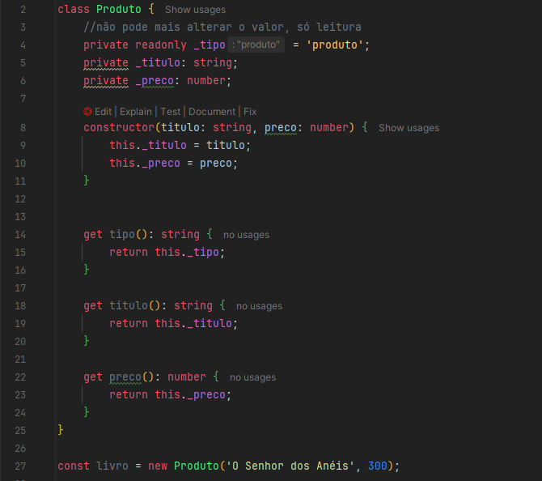
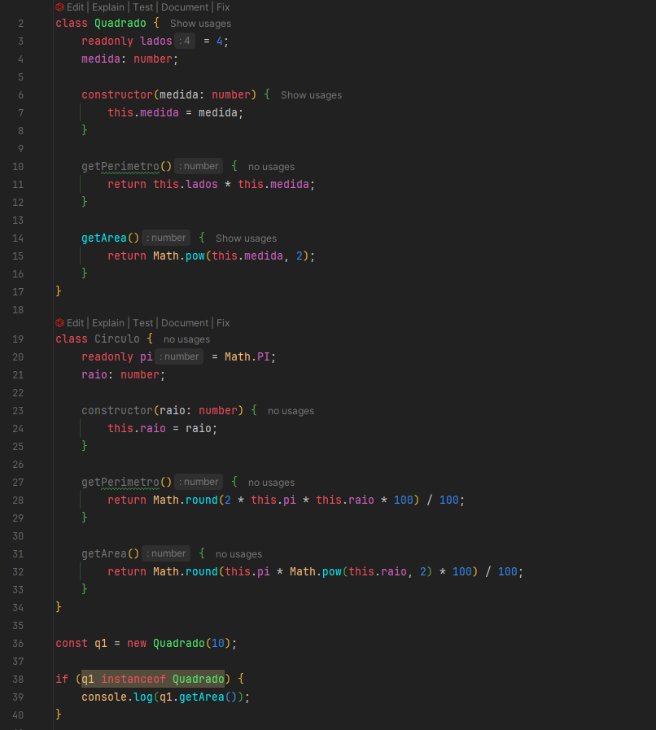
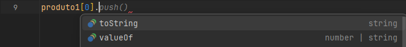
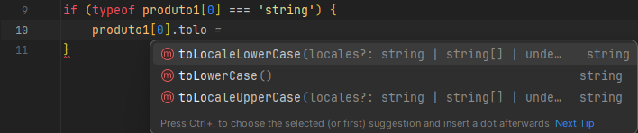
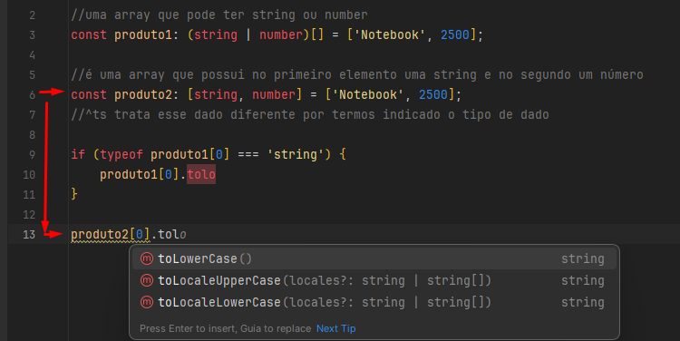
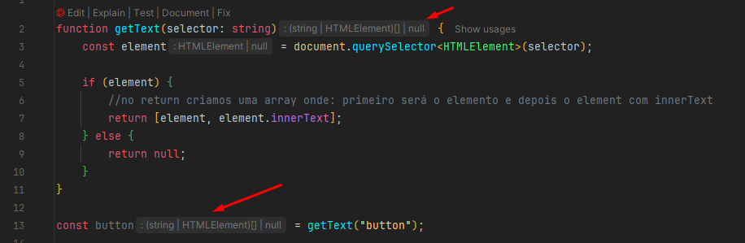
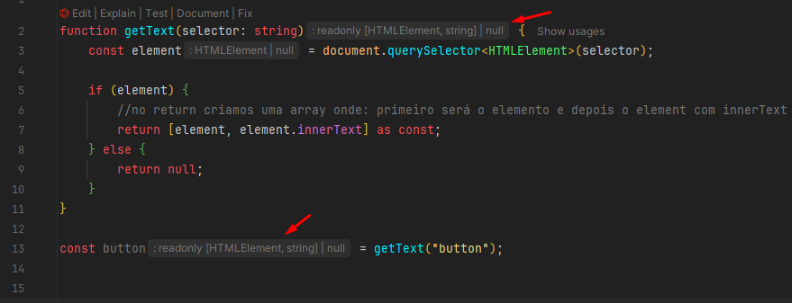

# About

Parte 3 do curso de Typescript da Origamid, lecionado pelo André Rafael.

Agora, entraremos mais em objetos, interfaces, DOM, generics, funções, etc.

Caso tenha alguma dúvida, recorra à [Parte 1]() do estudo.

# Classes

As classes/funções construtoras são responsáveis **pela construção de objetos que já vimos**, como ``MouseEvent``, ``HTMLElement``,
e todos os demais.

Dentro dos {} é onde ficarão as propriedades que irão existir quando instanciarmos essa classe, criando um objeto a partir
dela.

```ts
class Produto {
    tipo = 'produto';
    titulo: string;

    constructor(titulo: string) {
        this.titulo = titulo;
    }
}

const livro = new Produto('O Senhor dos Anéis');
```

Obrigatoriamente, como passamos o atributo de título dentro do construtor, precisamos passar ele ao instanciar o 
objeto.

Se fosse para ser opcional, passaríamos o "?" ``(titulo?: string)``.

## Modificadores (private, protected, readonly)

Irão trazer uma segurança a mais durante a construção da nossa classe.

O TS fornece diversas palavras-chave (Modifiers), que podem ser utilizadas em propriedades de classes, modificando
o comportamento e uso delas.

Podem ser usados nas propriedades e métodos da classe, vejamos:



**Public** - padrão

**Private** - não deixa mais acessar as propriedades fora do escopo da classe. **Ao invés disso, podemos fazer um método
get para buscar o preço, por exemplo.**

**Readonly** - somente leitura.

**Protected** - Diferente do private, deixa subclasses (que estão usando extend) acessarem a propriedade. 

**Static** - Um método estático não está dentro de objetos instanciados, somente da classe em sí. Por exemplo:

```ts
class Produto {
    preco: number;
    
    static transformarPreco(preco: number) {
        return `R$ ${preco}`;
    }
}

const livro = new Produto()
```

Livro não terá acesso ao método `transformarPreco`, somente a classe Produto.

## Class e Interface

Como falamos acima, a classe já gera a interface do objeto.

Portanto, ao definirmos uma classe, a sua interface é gerada automaticamente pelo TS. A definição da classe é o que
utilizamos para verificar se um objeto que criarmos (tipo um `const livro = new Ob()`), é uma instância da mesma, utilizando `instanceof class`.

Note no exemplo abaixo, que antes de acessarmos o método de `getArea()`, nós verificamos se ela é uma `instanceof Quadrado`.



Outro exemplo: um array de números. Mapeamos ele para transformar os números em quadrado/círculo. Depois, fazemos um
forEach para verificar qual número pertence a cada classe, pegando sua respectiva área/perímetro.

```ts
const formas = [2, 32, 12, 3, 4, 20, 37, 9].map((n) => {
  if (n < 15) {
    return new Quadrado(n);
  } else {
    return new Circulo(n);
  }
});

formas.forEach((forma) => {
  if (forma instanceof Quadrado) {
    console.log(forma.getArea());
  }
  if (forma instanceof Circulo) {
    console.log(forma.getPerimetro());
  }
});

```


# Tuples

Tuples são diferentes em cada linguagem, pode ser um dado que possui diferentes dados nele.

No caso do TS, **tuples são arrays que possui dados em posições fixas**.

```ts
//uma array que pode ter string ou number
const produto1: (string | number)[] = ['Notebook', 2500];
//^array normal

//é uma array que possui no primeiro elemento uma string e no segundo um número
const produto2: [string, number] = ['Notebook', 2500];
//^tupla
```

Vamos relembrar o array! Se tentássemos acessar o `produto1[0]`, ele nos daria propriedades de string e number, visto 
que ele não consegue identificar.



Para que ele pudesse identificar e utilizar os métodos, teríamos que fazer um if, verificando seu `typeof`:



## E com as tuplas?

Como podemos ver no `produto2`, nós frisamos que o primeiro elemento é string e segundo number. Isso facilita a
verificação de tipo, não precisaríamos fazer o if:



## Por que tuplas são úteis?

Imagine que a gente queira reestruturar uma array, pegando valores específicos? Veja o que poderíamos fazer:

Automaticamente ao fazer isso, ele irá pegar o primeiro valor `'notebook` e alocar em nome e o segundo em preço. Logo,
nome se torna string e preço se torna number.

```ts
//tupla
const produto2: [string, number] = ['Notebook', 2500];

const [nome, preco] = produto2;
```


## as const

Transforma um dado `readonly` e infere o tipo de dado mais específico possível. Em métodos que retornam Array's, as
mesmas são transformadas em Tuples, vamos ao exemplo:

Quando passamos `as const` no final do returno ele faz duas coisas:

1. A primeira, como vimos, ele transforma essa array em `readonly`, ou seja: não poderíamos alterar o conteúdo do
elemento, o texto... nada.


2. Ele vai inferir o valor mais específico possível

Repare como estava antes do `as const`:



---

E depois:

O retorno da função mudou, juntamente com a declaração do elemento onde agora foi inferido um valor específico a ele.



## Exercício tuples

```ts
// 1 - Faça um fetch das vendas: https://api.origamid.dev/json/vendas.json
// 2 - Defina o tipo/interface de cada venda (tuple)
// 3 - Some o total das vendas e mostre na tela

async function fetchVendas() {
    const response = await fetch("https://api.origamid.dev/json/vendas.json");
    const json = await response.json();
    handleVendas(json);
}

fetchVendas();

type VendaTuple = [string, number, string, { marca: string; cor: string}];

function handleVendas(data: Array<VendaTuple>) {
    let totalVendas = 0;

    if (data) {
        data.forEach((venda) => {
            totalVendas+= venda[1];
            document.body.innerHTML = `
            <p>Total de vendas: ${totalVendas}</p>
            `;

        })
    }

    console.log("Total Vendas: " + totalVendas)
}
```